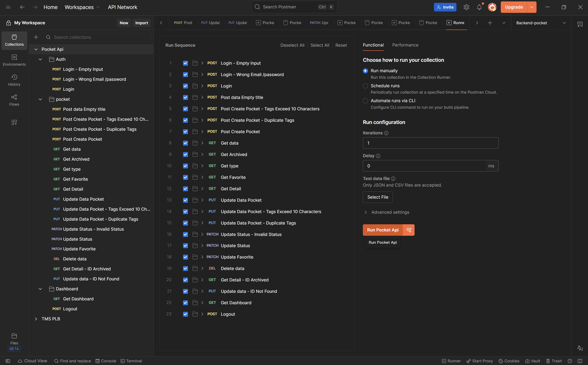
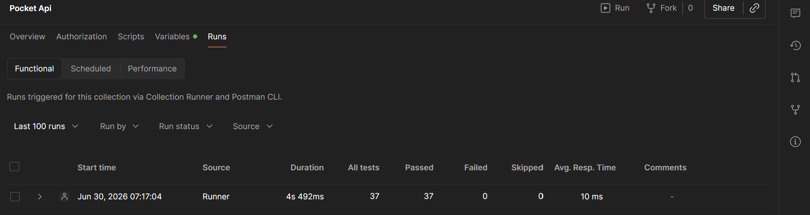
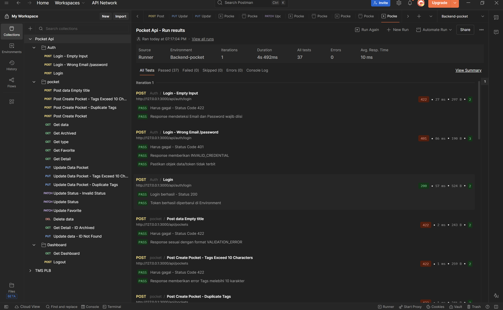

# Pocket App Backend

A robust backend REST API for a Pocket-like application, built with Go and Fiber. This service allows users to manage saved articles, videos, documents, and notes, complete with tagging, favorite toggles, and searching capabilities.

## Tech Stack
- **Language:** Go (Golang)
- **Web Framework:** Fiber v2
- **ORM:** GORM
- **Database:** MySQL (Production) / SQLite (Testing)
- **Validation:** Go Playground Validator v10
- **Authentication:** JWT (golang-jwt)
- **Security:** Bcrypt (Password Hashing)
- **Testing:** Testify & httptest

## Cara Menjalankan Project

1. Pastikan Anda telah menginstal Go (minimal versi 1.20+).
2. Clone repositori ini dan masuk ke direktori project.
3. Instal semua dependensi:
   ```bash
   go mod tidy
   ```
4. Jalankan server:
   ```bash
   go run cmd/server/main.go
   ```
   Aplikasi akan berjalan secara default di `http://127.0.0.1:3000`.

## Environment Variable yang Dibutuhkan

Buat file `.env` di root direktori dengan konfigurasi berikut (atau gunakan environment variables sistem):

```env
APP_PORT=3000
APP_ENV=development
DB_HOST=localhost
DB_PORT=3306
DB_NAME=pocket_app
DB_USER=root
DB_PASSWORD=secret
JWT_SECRET=secret
JWT_EXPIRY_HOURS=24

# Konfigurasi User Default untuk Seeding
SEED_USER_EMAIL=user@example.com
SEED_USER_PASSWORD=password123
SEED_USER_NAME="John Doe"
```

## Cara Menjalankan Database, Migration, dan Seed

Aplikasi ini menggunakan sistem **Auto-Migration** dan **Auto-Seeding** saat server dijalankan.
- **Database Connection:** Aplikasi akan otomatis membaca konfigurasi `DB_*` dari `.env` dan melakukan koneksi ke database MySQL.
- **Migration:** Skema database (`users` dan `pocket_items`) akan di-migrate secara otomatis menggunakan GORM `AutoMigrate` setiap kali `main.go` dijalankan. Indeks Fulltext juga akan ditambahkan jika belum ada.
- **Seeding:** Jika tabel `users` belum memiliki user dengan email yang dikonfigurasi di `.env`, aplikasi akan otomatis melakukan seeding data user beserta beberapa contoh `pocket_items`.

Anda tidak perlu menjalankan command terpisah untuk migration atau seed. Cukup jalankan:
```bash
go run cmd/server/main.go
```

## Cara Menjalankan Test

Proyek ini dilengkapi dengan Unit Test dan Integration Test. Untuk menjalankan semua test beserta laporannya, jalankan:

```bash
go test ./... -v
```
*(Catatan: Beberapa tes integrasi mungkin menggunakan SQLite in-memory atau memerlukan konfigurasi database test terpisah tergantung pada environment).*

## Hasil Testing (Dokumentasi Visual)

Berikut adalah snapshot dokumentasi eksekusi dari skenario pengujian manual/otomatis menggunakan Test Golang dan Postman API.







## Daftar Endpoint Utama

### Authentication (Public)
- `POST /api/auth/login` - Login user dan mendapatkan token JWT.

### Dashboard (Protected)
- `GET /api/dashboard` - Mengambil statistik summary dan item yang baru ditambahkan.

### Pocket Items (Protected)
- `GET /api/pockets` - List semua pocket item dengan dukungan pagination, sorting, dan filter (status, type, favorite, tag, search).
- `POST /api/pockets` - Membuat pocket item baru.
- `GET /api/pockets/:id` - Mendapatkan detail satu pocket item.
- `PUT /api/pockets/:id` - Mengubah data pocket item (title, url, description, tags, dll).
- `DELETE /api/pockets/:id` - Mengarsipkan (archive) pocket item (Soft delete logik).
- `PATCH /api/pockets/:id/status` - Mengubah status pocket item (`unread`, `reading`, `read`).
- `PATCH /api/pockets/:id/favorite` - Toggle status favorite pocket item.
- `POST /api/auth/logout` - Logout user.

## Link ke Dokumen Penting
- [Analisis PRD](docs/01-prd-analysis.md)
- [API Design](docs/02-api-design.md)
- [Database Design](docs/03-database-design.md)
- [Payload Contract](docs/04-payload-contract.md)
- [Mock API](docs/05-mock-api.md)
- [Testing Report](docs/06-testing-report.md)
- [Delivery Report](docs/07-delivery-report.md)
- [Postman Collection](docs/api-collection/Pocket%20Api.postman_collection.json)
- [Postman Environment](docs/api-collection/Backend-pocket.postman_environment.json)

## Link Recording Proses Pengerjaan
[Video Recording Proses Pengerjaan](https://drive.google.com/file/d/1Iqbf6kNlyaohzEnMoN5hKZ2H_z97YpdR/view?usp=drive_link)

## Tools AI yang Digunakan
- **Antigravity IDE (Gemini-powered)**: Digunakan sebagai pair-programmer AI agent untuk mendesain arsitektur, implementasi domain (auth, pocket, dashboard), refactoring, menulis unit test, mengatur best practices (repository pattern), dan membuat dokumentasi proyek.

## Asumsi Utama dan Known Issues

### Asumsi Utama:
1. **Tags Implementation:** Implementasi tags saat ini menggunakan tipe data `JSON` (kolom `tags` direpresentasikan sebagai array of strings) langsung di dalam entitas `pocket_items` demi kesederhanaan dan performa awal, bukan tabel relasional `Many-to-Many` (fitur tags terpisah telah di-rollback ke desain awal untuk menghindari konflik migrasi).
2. **Validasi Unik Tags:** Validasi bahwa tags dalam satu item tidak boleh ada yang duplikat diselesaikan pada tingkat *Validation layer* (`validate:"unique"`) dengan pesan error custom `"tags tidak boleh sama"`.
3. **Soft Deletion / Archiving:** Endpoint `DELETE /api/pockets/:id` tidak menghapus data secara fisik dari database, melainkan mengubah statusnya menjadi `archived`.

### Known Issues:
1. **Duplicate Key Warning saat Migrasi:** Saat pertama kali dijalankan, GORM mungkin mengeluarkan warning non-fatal `Error 1061 (42000): Duplicate key name 'ft_pocket_items_search'` jika Anda telah memiliki indeks fulltext di database. Ini aman dan aplikasi akan terus berjalan.
2. **Keterbatasan Pencarian Tag di SQLite:** Pencarian tag dengan raw SQL query atau `JSON_SEARCH` dioptimasi untuk MySQL. Jika menjalankan test integration yang bergantung pada in-memory SQLite murni, beberapa filter JSON mungkin bertingkah laku sedikit berbeda (meskipun fungsionalitas ORM utama telah ditangani).
